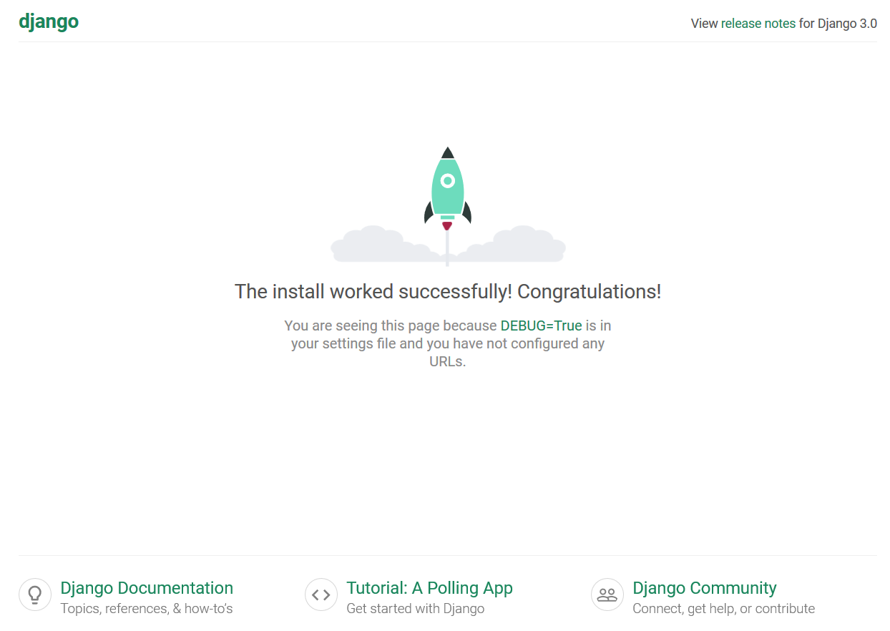
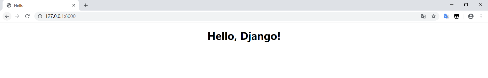
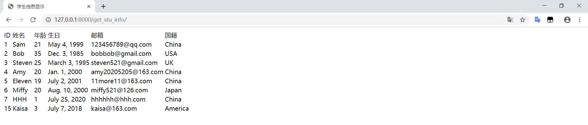

# 简单学生信息管理系统


## 开发技术
| 技术名称 | 技术版本 |
| :---: | :---: |
| Python | 3.7.6 |
| Pip | 20.0.2 |
| Conda | 4.8.2 |
| Django | 3.0.8 |
| MySQL | 8.0.16 |

## Django下载安装
这次不是基于PyCharm安装了，先是使用了默认的清华镜像，裂开：
```text
pip --default-timeout=1000 --no-cache-dir install Django
WARNING: pip is configured with locations that require TLS/SSL, however the ssl module in Python is not available.
Looking in indexes: https://pypi.tuna.tsinghua.edu.cn/simple
WARNING: Retrying (Retry(total=4, connect=None, read=None, redirect=None, status=None)) after connection broken by 'SSLError("Can't connect to HTTPS URL because the SSL module is not available.")': /simple/django/
WARNING: Retrying (Retry(total=3, connect=None, read=None, redirect=None, status=None)) after connection broken by 'SSLError("Can't connect to HTTPS URL because the SSL module is not available.")': /simple/django/
WARNING: Retrying (Retry(total=2, connect=None, read=None, redirect=None, status=None)) after connection broken by 'SSLError("Can't connect to HTTPS URL because the SSL module is not available.")': /simple/django/
WARNING: Retrying (Retry(total=1, connect=None, read=None, redirect=None, status=None)) after connection broken by 'SSLError("Can't connect to HTTPS URL because the SSL module is not available.")': /simple/django/
WARNING: Retrying (Retry(total=0, connect=None, read=None, redirect=None, status=None)) after connection broken by 'SSLError("Can't connect to HTTPS URL because the SSL module is not available.")': /simple/django/
Could not fetch URL https://pypi.tuna.tsinghua.edu.cn/simple/django/: There was a problem confirming the ssl certificate: HTTPSConnectionPool(host='pypi.tuna.tsinghua.edu.cn', port=443): Max retries exceeded with url: /simple/django/ (Caused by SSLError("Can't connect to HTTPS URL because the SSL module is not available.")) - skipping
ERROR: Could not find a version that satisfies the requirement Django (from versions: none)
ERROR: No matching distribution found for Django
WARNING: pip is configured with locations that require TLS/SSL, however the ssl module in Python is not available.
Could not fetch URL https://pypi.tuna.tsinghua.edu.cn/simple/pip/: There was a problem confirming the ssl certificate: HTTPSConnectionPool(host='pypi.tuna.tsinghua.edu.cn', port=443): Max retries exceeded with url: /simple/pip/ (Caused by SSLError("Can't connect to HTTPS URL because the SSL module is not available.")) - skipping
```
于是只能吸取之前PyTorch安装的狗操作，爆出上述错误后直接换豆瓣源，命令如下：<br/>
<code>pip --default-timeout=1000 --no-cache-dir install Django -i http://pypi.douban.com/simple --trusted-host pypi.douban.com</code><br/>
接下来可能需要查看Django版本顺便验证是否安装成功：
- Conda查看Django版本：<code>conda list django</code>
- Python查看Django版本：<code>python -m django --version</code>，也可以在 <code>import django</code> 后输入<code>print（django.VERSION)</code>

## Django项目创建和启动
### PyCharm创建
使用Django模板即可，建议下好Django后创建项目，选Conda创建就行，最好别总是创建虚拟环境。
### PyCharm启动
配置运行的基本配置即可运行，很方便。
### 命令行创建
```text
python manage.py startapp 应用名
```
### 命令行运行
```text
python manage.py runserver 
manage.py runserver 80      # 指定端口
```

## 运行示例


## 项目结构解读
|---info_management_django # 项目的根目录<br/>
&emsp;|---info_management_django # 项目目录<br/>
&emsp;&emsp;|---\_\_init\_\_.py # 文件夹的模块包标识文件<br/>
&emsp;&emsp;|---settings.py # 配置文件<br/>
&emsp;&emsp;|---urls.py # 路由系统 ===> url与视图的对应关系<br/>
&emsp;&emsp;|---wsgi.py # runserver命令就使用wsgiref模块做简单的web server<br/>
|---templates # 存放html静态模板 [templates文件夹解读](https://www.cnblogs.com/mashangsir/p/11432871.html)<br/>
|---static # 存放css、js等静态文件<br/>
|---manage.py # 管理文件<br/>
|---README.md # 项目的入门手册<br/>

## 2020-12-26更新日志
已经初步可运行，但会有偶发性错误！以后再来挖坟！




